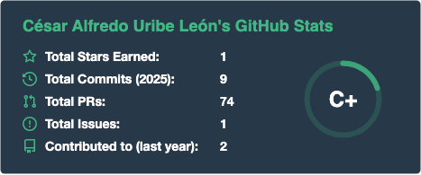
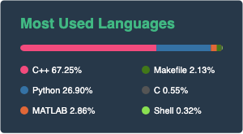

# Hi, I'm Cesar 👋

<h4>

Software developer ‣ DevOps ‣ Artificial Intelligence ‣ Blockchain 

</h4>

### About me 🧑‍💻
-----
👋 Hey there! I'm a software engineer who started out as a physicist working in computational physics and orbital mechanics, giving me a strong background physics and mathematics which bringing a analytical mindset to coding challenges.  

🚀 Along all my years of experience working as a software engineer, I've worked across the full software development spectrum:
- Primarily as a backend engineer, building robust and scalable systems
- Frontend development to create engaging user experiences
- DevOps and cloud infrastructure for reliable deployments
- AI/ML projects where I get to apply my analytical background
- Blockchain solutions exploring decentralized systems

🎓 Knowledge sharing is my passion: I spent 8 years teaching programming and data science, which gave me a knack for breaking down complex concepts. I also enjoy writing technical blog posts where I can share insights and help others learn.

💡 I'm always excited about:
- Learning new technologies
- Sharing knowledge with the community
- Solving problems
- Building efficient and scalable solutions

### General Skills ✨
------

### How to reach me 📬
----
🔍 Looking to collaborate on interesting projects? Let's connect!

* Email: uribeleon@gmail.com
* Linkedin: [@uribeleon](www.linkedin.com/in/uribeleon)

### Github Stats 📈
<!-- replace for a self-hosted server in my vercel account-->
 

<!--
**curibe/curibe** is a ✨ _special_ ✨ repository because its `README.md` (this file) appears on your GitHub profile.

Here are some ideas to get you started:

- 🔭 I’m currently working on ...
- 🌱 I’m currently learning ...
- 👯 I’m looking to collaborate on ...
- 🤔 I’m looking for help with ...
- 💬 Ask me about ...
- 📫 How to reach me: ...
- 😄 Pronouns: ...
- ⚡ Fun fact: ...
-->
